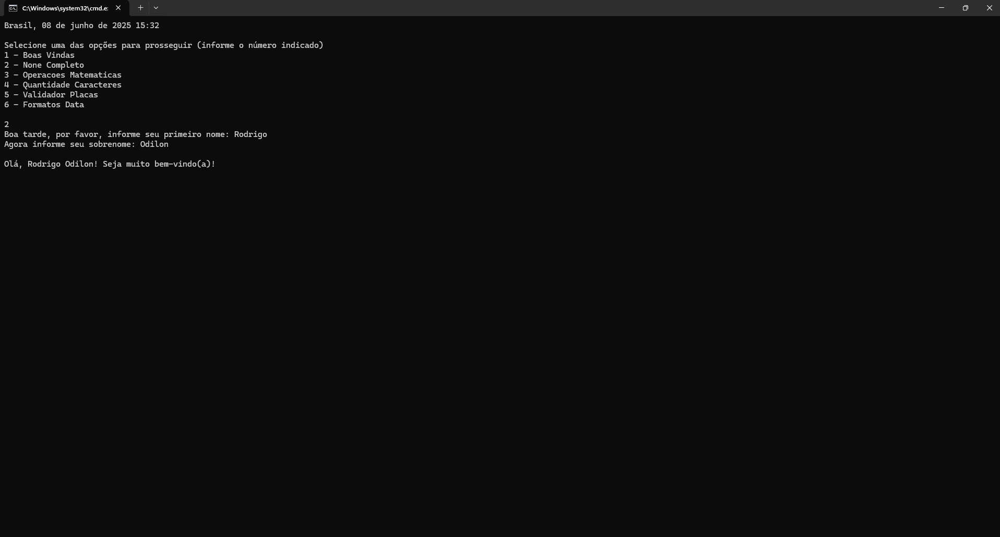

# 💻 Desafio Rocketseat - Praticando Conceitos (.NET Console App)


Este repositório contém a minha solução para o desafio prático da Rocketseat, disponível [neste link](https://efficient-sloth-d85.notion.site/Desafio-pr-tico-61b5a711351942bfb2f369351f85990d). O desafio consiste em criar uma aplicação simples em C# utilizando .NET, com o objetivo de reforçar conceitos fundamentais de programação.

---

## 🛠 Tecnologias utilizadas

- .NET
- C#
- Console Application

---

## 🚀 Como executar o projeto localmente

Para rodar o projeto na sua máquina, siga os passos abaixo:

1. Clone o repositório:
   ```bash
   git clone https://github.com/rodrigoodilon/DesafioRocketSeat1.git


## 📸 Demonstração


## 👨‍💻 Autor

Desenvolvido por [Rodrigo Odilon](https://github.com/rodrigoodilon)